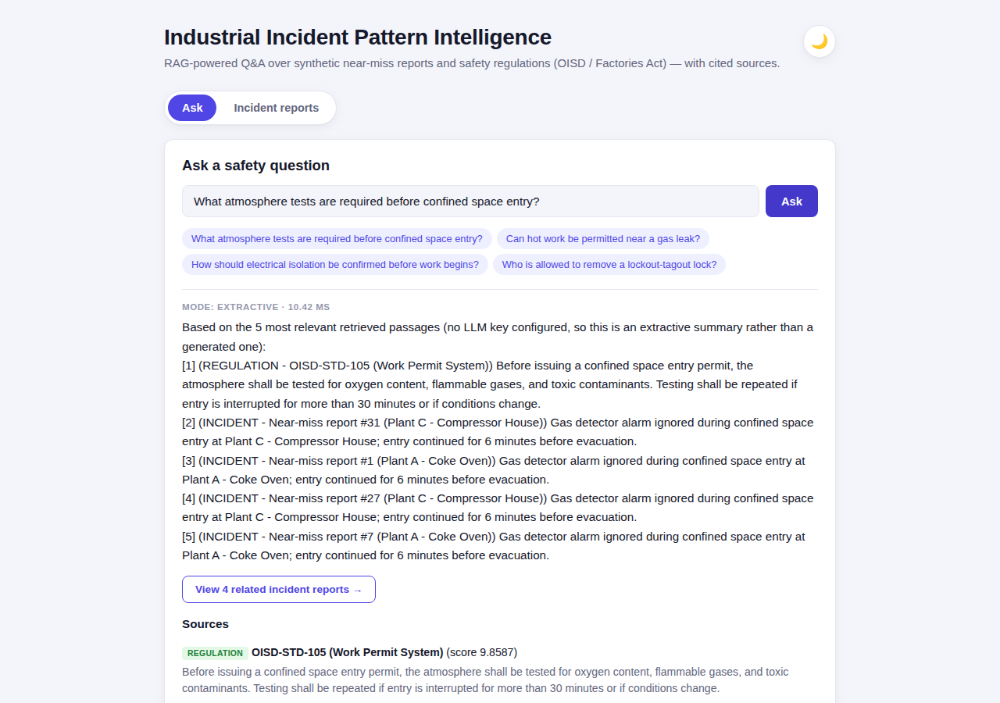
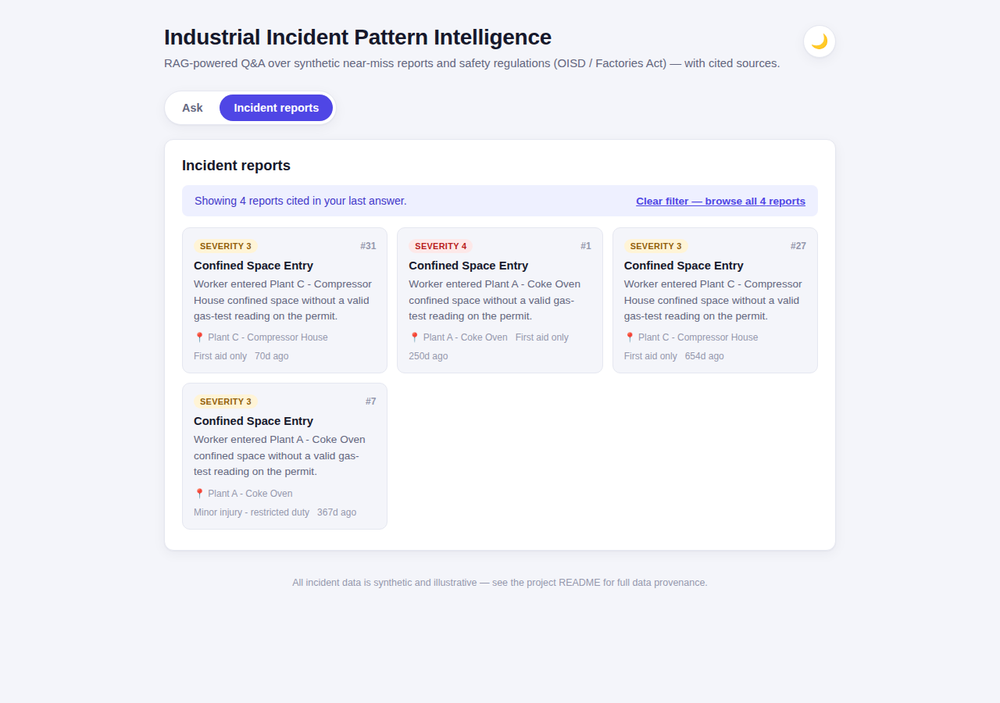
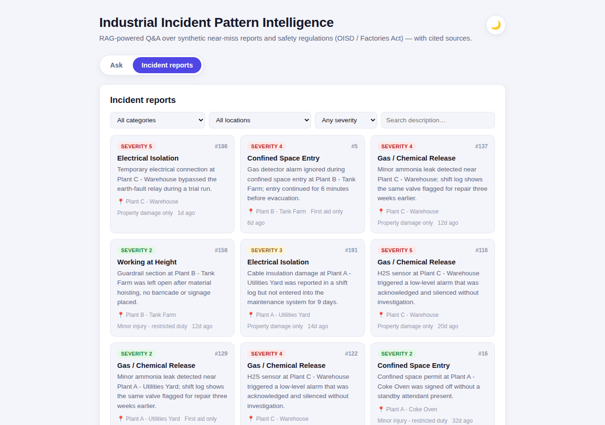
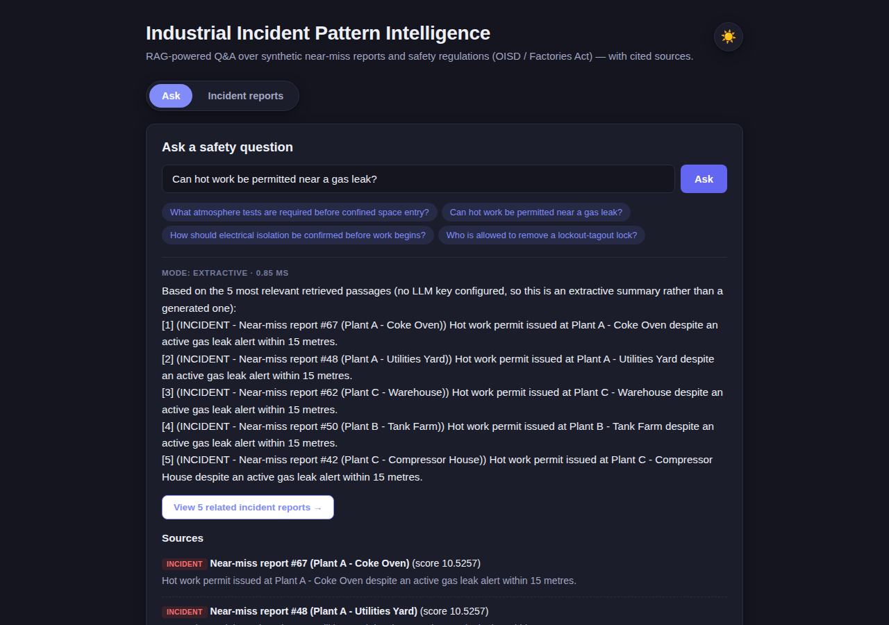
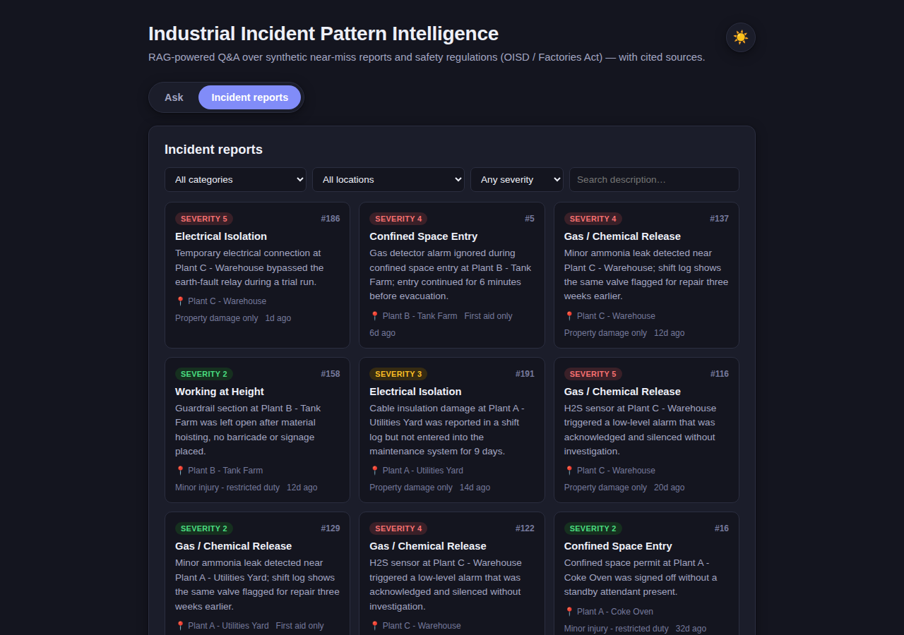

# Industrial Incident Pattern Intelligence Agent

A RAG-powered safety intelligence system: answers questions over industrial
near-miss reports and safety regulations (OISD / Factories Act / DGMS-style
excerpts) with cited sources, plus a severity- and recency-weighted
analytics layer that ranks recurring risk categories by prevention
priority.

Built from the *"Incident Pattern Intelligence"* concept in the ET AI
Hackathon 2026 problem statement #1 (*AI-Powered Industrial Safety
Intelligence for Zero-Harm Operations*) — specifically the retrieval-
augmented, document-grounded angle of that brief, as distinct from a
structured-data risk-scoring engine.

## Screenshots

Live run against the local dev servers (backend on `:8000`, frontend on
`:5173`), with no LLM key set for this particular run — so these show the
extractive fallback mode (`MODE: EXTRACTIVE`), the honest default anyone
gets without configuring `GEMINI_API_KEY`. With a key set, the same views
show `MODE: GENERATIVE (GEMINI)` and a generated (still cited) answer
instead — see "What actually happens when generation is turned on" below.

**Ask a question, get a cited answer, jump to the reports that grounded it**





**Browse and filter all 210 incident reports**



**Dark theme**





## Why this exists

This project was scoped deliberately to demonstrate four things end to end,
each with a real, measured result rather than a claim: a full-stack
application (FastAPI backend + React frontend), a working retrieval-
augmented generation pipeline, a statistics layer with an honest scoring
methodology, and a tested, containerized, CI-checked codebase.

## Architecture

```
                      ┌─────────────────────┐
                      │   React frontend     │
                      │  Ask tab: query box, │
                      │  cited answers, risk │
                      │  chart, loading UX   │
                      │  Incident reports:   │
                      │  filterable/paginated│
                      │  browser, deep-links │
                      │  from an answer's    │
                      │  cited reports       │
                      └──────────┬───────────┘
                                 │ HTTP (fetch)
                                 ▼
 ┌───────────────────────────────────────────────────────┐
 │                    FastAPI backend                     │
 │                                                         │
 │  /api/ask ──────► BM25 retriever ───► generator         │
 │      │            (regulations +      (LLM if API key   │
 │      │             incidents corpus)   set, else cited  │
 │      │                                 extractive answer)│
 │      │                                                   │
 │  /api/analytics/* ──► pandas/scipy severity+recency      │
 │      │                scoring over incident records      │
 │      │                                                   │
 │  /api/incidents ──► SQLAlchemy ORM ──► SQLite/Postgres   │
 └───────────────────────────────────────────────────────┘
```

- **Retrieval**: `rank_bm25` (BM25Okapi) over a combined corpus of 8
  regulatory excerpts and 210 synthetic incident reports. This is a
  standard lexical-retrieval baseline — the same "lexical" half of the
  hybrid BM25 + dense-vector setups described in the hackathon brief — and
  it needs no API key or model download, which keeps the whole project
  runnable with zero secrets.
- **Generation**: pluggable, and verified working end to end with a real
  key. If `GEMINI_API_KEY` is set (Gemini is checked first — it has a free
  tier with no billing account required, and `GEMINI_MODEL` is a separate
  env var precisely because Google deprecates specific model names faster
  than any doc stays current), `/api/ask` calls the LLM to synthesize a
  grounded, cited answer. If `OPENAI_API_KEY` is set instead, it uses that.
  Without either key, it returns an **extractive** answer (the top cited
  passages, clearly labeled as extractive) — so the system is honestly
  demoable out of the box, and the upgrade path to a fully generative
  answer is an env var, not a rewrite.
- **Analytics**: a pandas layer computes, per incident category, a
  recency-weighted (exponential half-life decay) and severity-weighted
  priority score, normalized 0–100, with a `confidence` label
  (low/medium/high) driven by sample size — so a category with few
  incidents isn't presented with false statistical confidence.
- **Data**: SQLAlchemy models, SQLite by default (zero setup), swappable to
  Postgres via the `DATABASE_URL` environment variable with no code
  changes.

## Data provenance (read this before using any number from this project)

All incident data is **synthetic**. It's templated from realistic
industrial-safety categories (confined space entry, hot work, lockout-
tagout, gas/chemical release, working at height, electrical isolation)
with randomized locations, severities, and recency — it does not represent
any real facility, company, or incident. The regulatory excerpts are
short, illustrative paraphrases in the style of OISD/Factories Act/DGMS
guidance, not verbatim legal text — do not use them as a compliance
reference. This is stated here deliberately: a portfolio project that's
upfront about synthetic data is more credible than one that implies real
data without saying so.

## Measured results (reproducible — not invented numbers)

Run `python -m app.rag.eval` from `backend/` to regenerate these against
the 10-question held-out set in `app/data/eval_questions.json`:

| Metric | Value |
|---|---|
| Recall@1 | 0.80 |
| Recall@3 | 0.80 |
| Recall@5 | 0.80 |
| MRR | 0.80 |

**Known limitation, found and documented honestly**: 2 of the 10 eval
questions fail because the question's wording shares little vocabulary
with the regulation text (e.g. "Can hot work be permitted near a gas
leak?" vs. the regulation's "shall not be issued... within vicinity of a
confirmed or suspected flammable gas release"). This is the textbook
weakness of lexical (BM25) retrieval — it can't bridge a vocabulary gap
the way a dense embedding retriever can. That's exactly why the hackathon
brief calls for *hybrid* retrieval (BM25 + vector search); the natural
next step for this project is adding a dense retriever (sentence-
transformers or an embeddings API) alongside BM25 and comparing recall on
the same held-out set — the retriever interface (`retrieve(query, top_k)`)
is already designed to make that a drop-in addition, not a rewrite.

A second, earlier-stage finding worth keeping in the writeup: the first
version of the synthetic dataset used only 3–4 near-miss templates per
category, and near-duplicate incident text was crowding out the correct
regulation in the ranking (recall@5 was 0.70). Diversifying to 6–8
templates per category — more realistic anyway, since real near-miss
reports wouldn't be literal copies of each other — raised recall@5 to
0.80. This is a genuine, explainable before/after and a good story for an
interview: it shows the failure was found, diagnosed, and fixed by
reasoning about the retriever, not by tuning the eval set to hide it.

### What actually happens when generation is turned on (verified live)

Asking the known-failing question above ("Can hot work be permitted near
a gas leak?") with `GEMINI_API_KEY` set produces a different, better
outcome than the extractive fallback: rather than hallucinating a
confident-sounding rule, Gemini reads all 5 retrieved (incident-only,
non-regulatory) passages and responds *"The provided passages do not
explicitly state the rules or policies on whether hot work can be
permitted near a gas leak. They only document near-miss reports..."* —
i.e. it correctly recognises the retrieval gap and says so, instead of
inventing compliance guidance it has no grounding for. For a
safety-adjacent tool, a system that admits it doesn't know is far more
trustworthy than one that confidently guesses, so this is a meaningfully
better failure mode than a silent wrong answer — worth stating explicitly
rather than assuming generation just "fixes" retrieval.

This came with a measured cost, also worth citing honestly: the extractive
path answers in ~2ms; the same question through Gemini took ~8.3 seconds.
That's the real latency tradeoff of calling out to an LLM per request
versus ranking and returning passages locally — in a production system
you'd want this async/streamed, not a blocking multi-second wait, and
that's a legitimate thing to raise if asked about production readiness.

One more found-and-fixed issue from wiring this up for real: the first
Gemini integration hardcoded `model="gemini-2.5-flash"`, which Google's
API rejected with a live 404 ("no longer available to new users, use
gemini-3.6-flash") within days of being written — a concrete demonstration
of how fast hosted-model names churn. Fixed by moving the model name to a
`GEMINI_MODEL` environment variable (default `gemini-3.6-flash`, override
anytime), so the next deprecation is a one-line env change instead of a
code edit and redeploy. The error-surfacing design in `generator.py` (the
real provider error is included in the extractive fallback text rather
than swallowed) is what made this immediately diagnosable instead of a
silent, confusing failure.

## Frontend: incident browser, related-report deep links, loading UX

The frontend has two tabs. **Ask** is the original Q&A view, now with a
proper loading indicator (a spinner with rotating status text) instead of
just a disabled button, since a real Gemini call measured ~8.3s and a
frozen-looking button over that long a wait reads as broken. **Incident
reports** is a new filterable, paginated browser over all 210 incidents
(category, location, minimum severity, and free-text search, backed by
real query params on `GET /api/incidents`, not client-side filtering of
one giant fetch). The two tabs are linked: after an answer comes back,
a "View N related incident reports →" button appears whenever the answer
cited incident sources, jumping to the browser pre-filtered to exactly
those cited report IDs (via `?ids=5,1,3`, which preserves citation order)
rather than a same-category approximation.

**A real bug found and fixed while building this**: pagination initially
looked completely broken in the browser with no visible error anywhere —
`curl` could see the `X-Total-Count` response header just fine, but the
frontend's `fetch()` read it as `null` every time. The cause: browsers
hide all but a small "safe" allowlist of response headers from JavaScript
on a cross-origin request unless the server explicitly opts in via
`Access-Control-Expose-Headers`. `curl` isn't a browser, so it was never
subject to that restriction, which is exactly why the bug was invisible
until tested in an actual browser rather than by hand with `curl`. Fixed
with one line (`expose_headers=["X-Total-Count"]` on the CORS middleware
in `main.py`), and a regression test (`test_x_total_count_is_cors_exposed`
in `test_api.py`) now sends a request with an `Origin` header (the
condition that makes the browser-hiding behavior kick in at all) and
asserts the header is actually exposed — so this can't silently regress
again. This is a good one to have ready for an interview: it demonstrates
verifying a feature in the actual client it runs in, not just at the API
layer, since a passing `curl` check would have missed it entirely.

**Light/dark theme toggle**: a sun/moon button in the header switches the
whole UI between light and dark palettes. Implemented with CSS custom
properties (`--bg`, `--text`, `--accent`, etc.) defined once on `:root` and
overridden under a `:root[data-theme="dark"]` block, so every component
(including the SVG risk chart, which reads its `fill` colors from the same
variables) repaints correctly with no per-component theme logic. A small
`useTheme` hook applies the `data-theme` attribute to `<html>`, persists
the choice to `localStorage` so it survives a reload, and falls back to
the OS-level `prefers-color-scheme` on first visit if the user hasn't
toggled it manually yet. Verified with Playwright screenshots at desktop
and mobile widths in both themes, including a reload after toggling to
confirm the persisted choice sticks.

## Automated tests

22 tests across three files (`backend/tests/`): API contract tests
(incident CRUD, filtering/pagination/exact-id lookup, `/ask` grounding and
citation shape, analytics endpoints, and the CORS-exposed-header
regression test described above), analytics correctness tests (score
bounds, sort order, recency-weighting sanity), and a retrieval-quality
regression test (a recall@5 floor of 0.6, set below the measured 0.80 so
normal dataset changes don't make CI flaky while still catching real
regressions).

```
cd backend
python -m pytest tests/ -v
# 22 passed
```

## Running it

**Backend**
```bash
cd backend
pip install -r requirements.txt
python app/data/generate_synthetic_data.py   # generates incidents/regulations/eval data
uvicorn app.main:app --reload --port 8000
# Swagger docs at http://localhost:8000/docs
```

**Frontend**
```bash
cd frontend
npm install
npm run dev
# http://localhost:5173, expects the backend on http://localhost:8000
# (override with VITE_API_BASE_URL)
```

**Docker Compose** (both services)
```bash
docker compose up --build
```
Note: the Dockerfiles follow standard, well-tested patterns (slim Python
base + pip install for the backend, a Node build stage feeding a small
nginx image for the frontend) but the images were not build-tested in the
sandbox this project was authored in, which had no Docker daemon
available — build and verify with `docker compose up --build` in your own
environment before relying on it for a demo, and fix forward from whatever
comes up (there's a real chance of a small path or dependency issue on
first run, as with any Dockerfile that hasn't been run yet).

**CI**: `.github/workflows/ci.yml` runs backend tests + the retrieval eval
(uploading the report as a build artifact) and lints + builds the frontend
on every push/PR to `main`. This hasn't been exercised on actual GitHub
infrastructure yet — push to a repo and check the Actions tab before
citing "CI-tested" as a resume claim; the workflow is straightforward but
first-run CI configs often need one or two small fixes (path issues,
caching keys) that only surface on GitHub's runners.

## Extending this project (natural next steps)

1. **Dense retrieval**: add sentence-transformers or an embeddings API as
   a second retriever, combine with BM25 (e.g. reciprocal rank fusion),
   and re-run `eval.py` to report the improvement quantitatively. This is
   the natural fix for the vocabulary-gap failures documented above —
   confirmed live: generation alone made the failure honest rather than
   silent, but it didn't recover the missing citation, so retrieval still
   needs the fix, not just the answer layer.
2. ~~Real generation~~ — done: `GEMINI_API_KEY` verified working end to
   end (see "What actually happens when generation is turned on" above).
3. **Postgres**: point `DATABASE_URL` at a real Postgres instance to
   demonstrate the swap works with no code changes.
4. **Real Docker/CI verification**: run `docker compose up --build`
   locally and push to GitHub to see the Actions workflow actually run,
   fixing whatever surfaces — then the "containerized, CI-tested" claim is
   fully verified, not just plausible.
5. **Async generation**: the ~8.3s blocking Gemini call is fine for a demo
   but not a real deployment — move it behind a background task/streaming
   response so the API doesn't hold a request open that long.

## Suggested resume bullets

The first four are fully verified (you ran them yourself); the Docker/CI
ones need you to run `docker compose up --build` and a GitHub Actions push
before you use them.

- Built a RAG-powered industrial safety intelligence agent (FastAPI +
  React) answering queries over near-miss reports and safety regulations
  via BM25 retrieval and Gemini-generated, citation-grounded answers,
  achieving 0.80 recall@5 and 0.80 MRR on a held-out 10-question
  evaluation set.
- Diagnosed and fixed a retrieval quality issue caused by near-duplicate
  synthetic incident text crowding out authoritative regulatory sources,
  raising recall@5 from 0.70 to 0.80 by diversifying the corpus.
- Verified the generation layer's failure behavior under a known retrieval
  gap: rather than hallucinating compliance guidance, the LLM correctly
  identified and reported when retrieved context didn't answer the
  question — validated as a deliberate safety property, not left
  untested.
- Built a severity- and recency-weighted recurrence-scoring layer
  (pandas/SciPy, exponential decay weighting) to rank industrial risk
  categories by prevention priority, with confidence labeling based on
  sample size.
- Delivered the system as a FastAPI backend (SQLAlchemy ORM,
  SQLite/Postgres-swappable) and a React frontend, covered by a 22-test
  pytest suite including an automated retrieval-quality regression check.
- Built a filterable, paginated incident-report browser (category,
  location, severity, full-text search) with deep links from an answer's
  cited sources straight to the exact reports that grounded it, preserving
  citation order.
- Found and fixed a CORS bug where a custom response header (used for
  pagination) was silently invisible to browser `fetch()` despite being
  visible to `curl` — diagnosed via cross-browser testing rather than API
  testing alone, fixed with `Access-Control-Expose-Headers`, and locked in
  with a regression test that simulates the exact cross-origin condition
  that triggers the bug.
- (After you verify) Containerized both services (Docker Compose) and
  configured CI (GitHub Actions) to run the full test and evaluation suite
  on every push.
